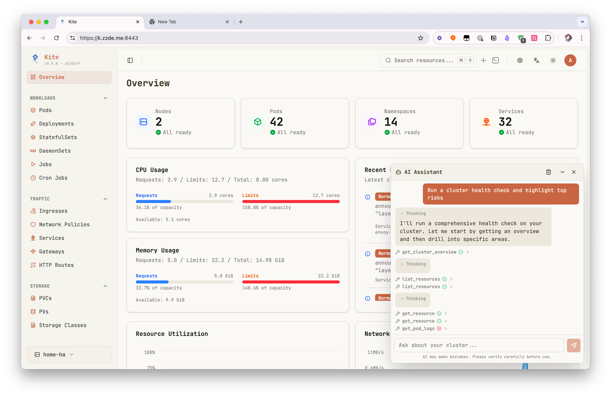
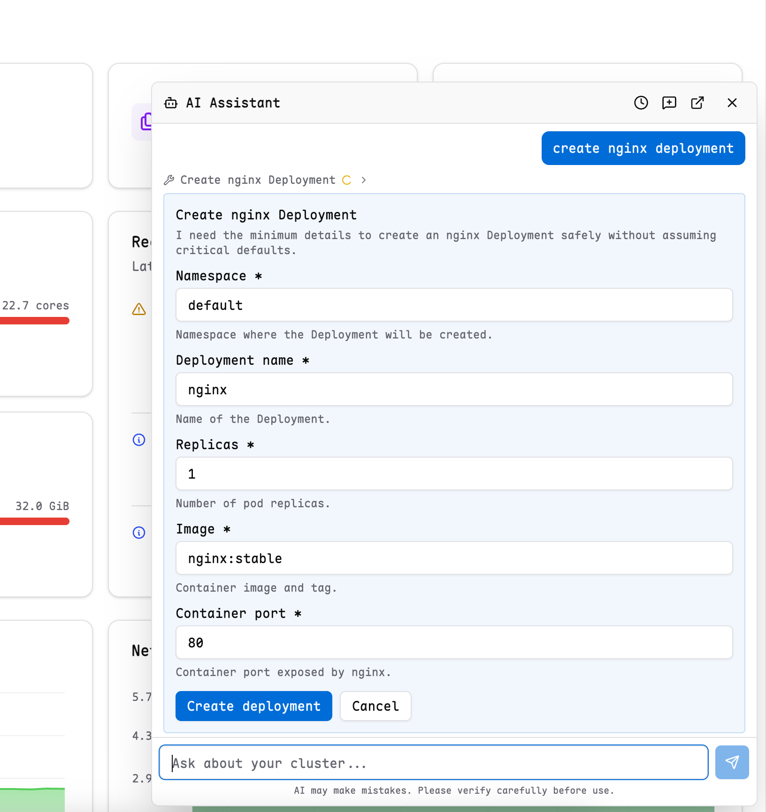
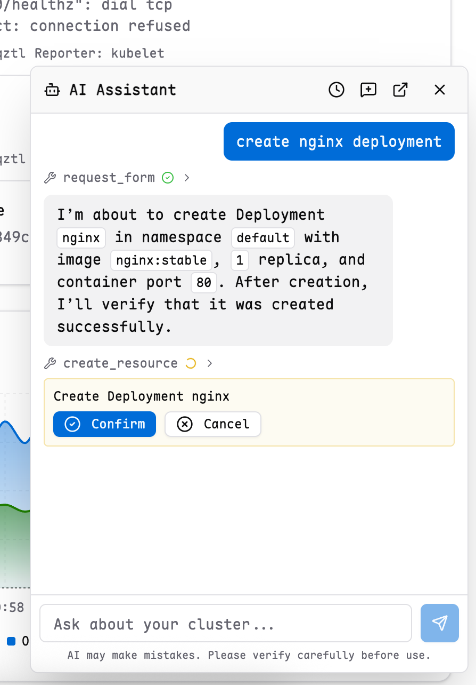

# AI Assistant

Kite includes a built-in AI assistant for Kubernetes operations. It can explain cluster state, inspect resources, read logs, query Prometheus metrics, and help with common changes without leaving the current workspace.

## Enable AI

1. Open `Settings`.
2. Go to `General`.
3. Turn on `AI Agent`.
4. Choose a provider:
   - `OpenAI Compatible`
   - `Anthropic Compatible`
5. Fill in `Model` and `API Key`.
6. Optionally set `Base URL` and `Max Tokens`.
7. Save the settings.

If you use a self-hosted or proxy-compatible endpoint, set the `Base URL` to your API endpoint.

## Open The Assistant

After AI is enabled, a floating AI button appears in the lower-right corner of the workspace. Click it to open the chat panel.

From the chat panel, you can:

- start a new chat
- review chat history
- open the conversation in a separate tab for more space

## What The Assistant Can Do

The assistant is designed for day-to-day Kubernetes work inside Kite. Common use cases include:

- explain the current page, resource, or namespace you are viewing
- get a resource in YAML form
- list resources in the current namespace or across the cluster
- read pod logs for troubleshooting
- summarize overall cluster status
- query Prometheus metrics when Prometheus is configured
- create, update, patch, or delete Kubernetes resources after confirmation

Kite passes the current page context to the assistant, so it can use the current cluster, namespace, and resource page as the default scope when appropriate.

## Confirmation And Structured Input

For write operations, Kite does not immediately execute the change. The assistant first prepares the action, then asks for confirmation in the chat UI.

When required details are missing, the assistant can also ask for:

- a short choice list
- a small structured form

This keeps the workflow inside the chat panel instead of requiring free-form back-and-forth for simple inputs.

## Permissions And Safety

The AI assistant works within Kite's existing access model.

- It only operates on the currently selected cluster.
- It respects the current user's RBAC permissions.
- If the user cannot read logs, exec into pods, or modify a resource, the assistant cannot bypass that restriction.
- Prometheus queries are only available when Prometheus is configured for the current cluster.

For related setup details, see:

- [RBAC Configuration](../config/rbac-config)
- [Prometheus Setup](../config/prometheus-setup)

::: tip
AI can make mistakes. Review generated actions carefully before confirming them.
:::
